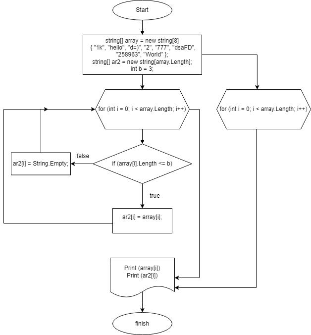

Задача: Написать программу, которая из имеющегося массива строк формирует новый массив из строк, длина которых меньше, либо равна 3 символам. Первоначальный массив можно ввести с клавиатуры, либо задать на старте выполнения алгоритма. 

1. Задал готовый массив строк (array)
2. задал второй массив для вывода (ar2)
3. Создал метод void Vivod для вывода на консоль первого (готового) массива
4. Создал цикл который проходит всю длинну первого массива, проверяет есть ли элементы меньше или равно 3 и записывает во второй массив (ar2).

Составил блок-схему, которая находится в этой же папке в формате png: 